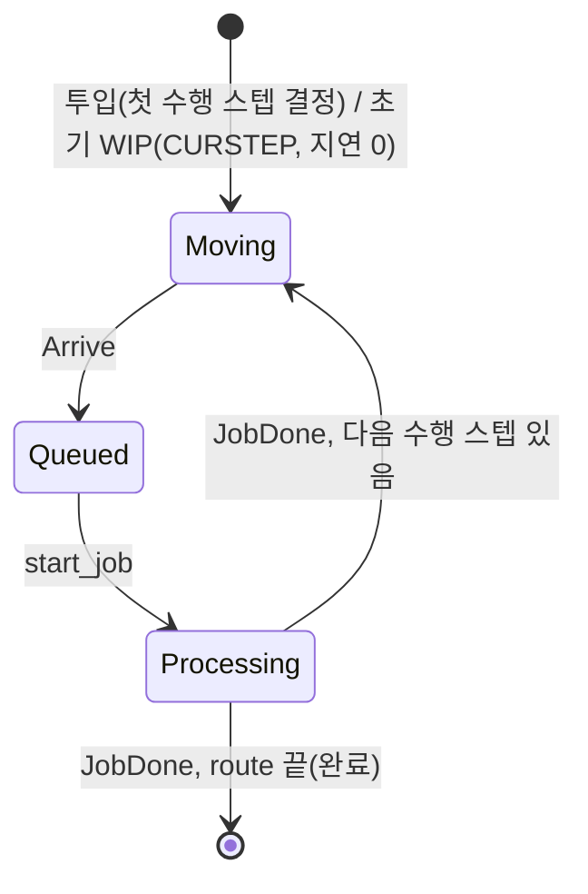
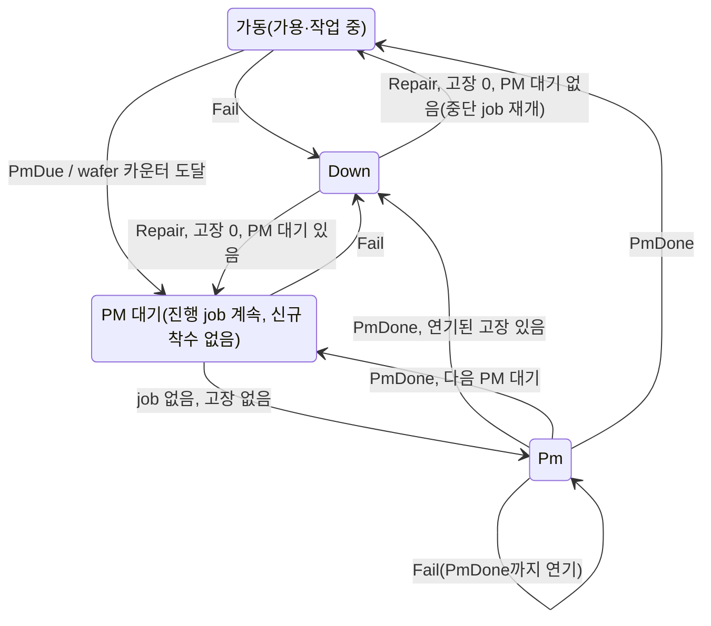

# SMT2020 시뮬레이션 엔진·모델 명세

`des-core`(DES 엔진)와 `smt2020`(로더·시뮬레이션 모델·운영 전략·통계)의 동작을 코드 기준으로 기술한다. 데이터셋 구성·원천 데이터 결함·검증 수치 표는 [README](README.md)를 따른다. 문서·데이터에 근거가 없는 동작은 `(가정)`, 근거가 AutoSched 기준 결과(`.rep`) 대조이면 `(가정, 기준 결과 근거)`로 표기한다.

## 1. 구성

| 경로 | 역할 |
|---|---|
| `crates/des-core/src/time.rs` | 시각 `Time = i64` ms, SECOND·MINUTE·HOUR·DAY |
| `crates/des-core/src/queue.rs` | 미래 사건 목록(FEL) |
| `crates/des-core/src/engine.rs` | `Model`·`Scheduler`·`Simulation`(사건 루프, 종료 시각, 관측 사건, 정지) |
| `crates/smt2020/src/data.rs` | `Dataset` 데이터 모델, 데이터셋 파일 형식 |
| `crates/smt2020/src/asd.rs`, `asd/table.rs` | AutoSched `.asd` 로더, 표 파서, 입력 검증, order 이름 |
| `crates/smt2020/src/rng.rs` | 용도별 난수 스트림 |
| `crates/smt2020/src/sim.rs` | `Config`, `Simulation`(단계 실행·pass·상태·결과), `Progress`, `time`, `Error` |
| `sim/fab.rs` | 모델 `Fab`: 사건 처리, 투입·이동, 대기열 항목, job, 고장·PM, 예약, Stopping 집계, 기간, 종료 |
| `sim/status.rs` | 현재 상태: `LotStatus`, `ToolStatus`, `ToolGroupStatus`, `SegmentStatus`·`SegmentLot` |
| `sim/dispatch.rs` | 툴 순서, lot 선택·순위 키, 배치 구성, Stopping 보류 표시 |
| `sim/tool.rs` | 툴: job 단계 시간표, cascading 슬롯, 일시정지·재개, 상태 시간 집계 |
| `sim/routes.rs` | route 사전 계산: 기대 스텝시간, 잔여 작업, RPT, CQT litho 여부·구간 TG, 배치 호환 키, setup 구성원 |
| `sim/plan.rs` | 투입 계획: 부하 계수, 종료 시각 전 투입, 부품별 잔여 투입 수 |
| `sim/stats.rs` | 통계 창, 기간 보고서, `Results`, digest |
| `sim/strategy.rs` | 운영 전략 해석·상태, Stopping 임계 해제 판정 |
| `crates/smt2020/src/report.rs` | 측정값(논문 단위), 복제 요약(평균·95% CI), CSV |
| `crates/smt2020/tests/datasets.rs` | 실데이터 로드·실행 테스트, 페이지 데이터셋 단계 실행 |
| `crates/wasm/src/lib.rs`, `crates/python/src/lib.rs` | JS·Python 포장: 코어 API 위임, 스키마 변환(4.6) |

```text
asd::load(dir) ─▶ Dataset ◀─▶ 데이터셋 파일(to_bytes·from_bytes)
Simulation::new(Arc<Dataset>, Config)
  ├─ (QTS, FF 미지정) 설정 전체 검증 후 1차 pass: 같은 설정에서 CQT 규칙·Stopping 제외(8.3)
  ├─ Fab::new          설정 검증, 전략 해석, route 사전 계산, 투입 계획, 보고 기간, 툴 생성
  └─ des_core::Simulation::new   Fab::init: 첫 사건·기한 사건 예약 (시각 0)
run(until)·run_observed(until, 관찰자)   반복 호출 = 이어서 진행
  ├─ 모델 사건 + 1일 관측 사건(관찰자 호출, Break = 일시정지) + 종료 시각(일시정지)
  ├─ 1차 pass 완료 ─▶ 측정 FF로 본 pass 생성
  └─ 마지막 lot 완료 사건 ─▶ Drain 보고 ─▶ stop ─▶ finished, results()
progress()·lots()·tools()·tool_groups()·segments()   어느 시점이든 읽기 전용
reset(Config) ─▶ 시각 0
report::summarize(&[Results]) ─▶ 측정값별 평균·표준편차·95% CI
report::compare(&[Results], &[Results]) ─▶ 복제 짝 차이 평균·95% CI
```

## 2. DES 엔진(`des-core`)

사건 스케줄링(event scheduling) 관점. 시계는 다음 사건 시각으로 진행하고, 실행 종료·관측도 사건으로 처리한다(상태 반복 확인 없음).

- 시각: `i64` ms, 0 = 실행 시작. 정수라 사건 순서가 정확하고 네이티브·wasm 결과가 같다.
- 미래 사건 목록(`EventQueue`): `BinaryHeap` 최소 힙, 키 (시각, 예약 순번). 예약 순번은 push마다 1 증가 → 동시각 사건은 예약 순서(FIFO). 페이로드는 비교하지 않는다.
- `Model`: `type Event`, `init(sched)`(t = 0, 1회), `handle(event, sched)`(`sched.now()` = 사건 시각).
- `Scheduler`: `now()`, `schedule_at(t, e)`(t < now면 panic, 인과성 위반), `schedule_in(d, e)` = `schedule_at(now + d, e)`, `stop()`(현재 사건 처리 후 실행 종료, 대기 사건 유지). `schedule_in(0, e)`는 현재 시각에 이미 예약된 사건 뒤에 처리된다.
- `Simulation::new(model)`: 시계 0, `init` 호출.
- `run(until)`: 사건을 (시각, 순번) 순으로 꺼내 now = 사건 시각 → `handle` → 처리 수 + 1. 다음 사건이 `until`보다 늦으면 now = max(now, `until`) 후 `Reached`, 모델이 `stop`하면 `Stopped`, 사건이 없으면 `Exhausted`로 종료. 다시 호출하면 남은 사건부터 이어진다. `until = Time::MAX`는 종료 시각 없음.
- `run_observed(until, interval, 관찰자)`: `run`에 관측 사건열(interval의 배수, `until` 이하)을 시각 순으로 병합. 관측 시각 이하 사건을 모두 처리한 뒤 now = 관측 시각으로 관찰자(모델, 시각)를 호출하고, `Break`이면 `Interrupted`로 종료. 첫 관측은 now 다음 배수라 중간에 멈췄다 이어도 관측 격자가 같다.
- `events_processed()`: 처리한 모델 사건 수(관측 제외).

## 3. 입력 데이터(`asd`, `data`)

### 3.1 표 형식·값 변환

- 인코딩 UTF-16LE(BOM) 또는 UTF-8(BOM 허용). 탭 구분, 셀 앞뒤 공백 제거. `~`로 시작하는 셀부터 줄 끝까지 주석. 값 없는 줄 무시, 첫 줄 = 헤더. 오류 메시지는 `파일:행`.
- 수: 음수 아닌 유한 소수. 개수: 음수 아닌 정수. 백분율: (0, 100] → 확률. 플래그: yes·no(빈칸 = no).
- 기간: 값 × 단위(min·hr·day) → ms 반올림 1회. 단위만 있고 값이 없으면 오류.
- 날짜: `MM/DD/YY HH:MM:SS`(20YY, 필드 2자리, 달력 유효성 검사) → SIM_START 기준 ms.
- 분포: constant(값), exponential(평균), uniform(평균, 반폭; 반폭 ≤ 평균). 분포 열이 없는 표는 constant.

### 3.2 `options.def`

- 키 + 값(탭). 키가 빈 줄은 직전 키의 값 계속. COMMENT_CHARACTER는 `~`만.
- SIM_START(값 1개) = 날짜 기준. SEQ_ADDS_SETUP_DELAYS = N, USE_CALENDARS(Y/N) = Y만 지원.
- 파일 키 SETUPGROUP_FILES, STATION_FILES, SETUP_FILES, PRODUCT_FILES, DOWNCAL_FILES, PMCAL_FILES, ATTACH_FILES, FROMTO_FILES, PERIOD_FILE은 활성 파일 정확히 1개, ORDER_FILES는 여러 개. `file 이름` 항목만 활성(`~` 주석 항목·`none` 제외).
- `load_with_orders(dir, 파일 목록)`: ORDER_FILES 대신 지정 파일(비활성 `order.txt`·납기 시나리오)로 투입.
- `orders(dir)`: 활성 ORDER_FILES의 ORDER·PART·PRIOR. 부품 또는 우선순위가 섞인 order(초기 WIP)는 제외. 기준 결과(`order.rep`) 대조용.

### 3.3 파일별 해석·검증

| 파일 | 해석·검증 |
|---|---|
| `setupgrp.txt` | SETUPGRP 있는 행 = 새 setup 그룹, 각 행 (SETUP, MINRUN) 추가. MINQUEUE·MAXQUEUE·MINNUMSTN·MAXNUMSTN 기준은 오류 |
| `tool.txt` | STNFAM 빈 행 = 직전 TG의 다음 FWLRANK. RULE rule_HotLotFIRST(SETUPGRP 없음)·rule_LSSU(SETUPGRP 필수). FWLRANK rank_HP·rank_RSETUP·rank_FIFO·rank_CR, 중복·FIFO+CR 동시 금지. WAKERESRANK 없음·wake_LeastSetupTime. 배치 BATCHPER piece + BATCHCRITF crit_sameroutestep·crit_samepartfam\|crit_samestepname. STNCAP 1(기본)·2(cascading). STNQTY 기본 1, > 0. STNFAMSTEP_ACTLIST는 Custom_actlist_ASISemiOpersDuringSetupAndAdditionalLoadUnload만. PRERULERWL yes 금지. STNGRP = 영역, STNFAMLOC = 위치, LTIME·ULTIME = load·unload |
| `setup.txt` | (CURSETUP, NEWSETUP, STIME·SDIST·STIME2) → setup 변경 시간 분포. 빈 CURSETUP = 임의 출발. 쌍 중복 금지 |
| `part.txt` | PARTGRP Saleable(생산)·Engineering(E), PARTFAM, PART(중복 금지), ROUTEFILE·ROUTE. 같은 ROUTEFILE은 1회 로드, ROUTE 이름 일치 필수 |
| `route_*.txt` | 3.4 |
| `downcal.txt` | DOWNCALTYPE mttf_by_cal만. TTF·TTR 분포. 이름 중복 금지 |
| `pmcal.txt` | PMCALTYPE mtbpm_by_cal(MTBPM = 시작 간격) 또는 mtbpm_by_pieces(MTBPMUNITS pieces, wafer 수). 소요 분포 MTTRDIST·MTTR·MTTR2. 이름 중복 금지 |
| `attach.txt` | CALTYPE down·pm, RESTYPE stngrp(영역의 모든 TG)·stnfam(TG 1개). down: 첫 고장 분포 FOADIST·FOA. pm: FOADIST constant만, 시간형 FOA = 기간, wafer형 FOA = wafer 수(FOAUNITS 없음) |
| `fromto.txt` | (FROMLOC, TOLOC) → 반송 분포. 쌍 중복 금지 |
| ORDER_FILES | PART, PRIOR, PIECES(> 0), START(≥ SIM_START), DUE, HOTLOT(예약 플래그). REPEAT 있으면 주기형 스트림: RDIST constant만, REPEAT·RPT#·LOTSPERRPT(기본 1) > 0, CURSTEP 금지, 납기 오프셋 = DUE − START. 없으면 목록형 lot, CURSTEP = 초기 WIP 대기 스텝(이름 → 인덱스) |
| `period.txt` | PERIOD, PERIODSTART(오름차순), REPORT, RESET |

### 3.4 route 스텝 규칙

- STEP 이름 route 내 유일(LTL·리워크·CQT가 이름으로 참조). ROUTE = 부품의 route 이름.
- PTPER per_lot·per_piece·per_batch → 단위 Lot·Wafer·Batch. 공정 시간 PDIST·PTIME·PTIME2·PTUNITS.
- 배치: per_batch ⇔ 배치 TG ⇔ BATCHMN·BATCHMX 존재, 0 < BATCHMN ≤ BATCHMX(wafer).
- cascading 간격 c: BatchInterval은 per_lot, PartInterval은 per_piece에만. c 존재 ⇔ TG STNCAP 2, 0 < c ≤ 공정 시간 최솟값.
- setup: SETUP + WHEN(need·always) + STIME(선택). SETUP 없이 WHEN·STIME 금지.
- 샘플링 StepPercent, 없으면 100%.
- 리워크: RWKSTEP·REWORK·RWKTYPE lot 동시. 목표는 앞 스텝, 확률 < 100%.
- LTL: SVESTN yes ⇔ FORSTEP, 대상은 뒤 스텝.
- CQT: STEP_CQT ⇔ CQT, 종료는 뒤 스텝. 시작·종료 스텝 샘플링 100%.
- 배치 스텝, rule_LSSU TG의 setup 스텝: 샘플링 100%, 리워크 루프(목표 ~ 리워크 스텝) 밖. 대기 중인 배치·setup run이 기다리는 lot의 도착을 보장(7.8).

### 3.5 데이터 모델(`Dataset`)

| 항목 | 내용 |
|---|---|
| areas, locations | 영역·위치 이름 |
| tool_groups | 이름, 영역, 위치, 툴 수, load·unload, cascading, 배치 기준(SameRouteStep·SameFamilyStepName), 규칙(HotLotFirst·SetupRun(setup 그룹)), 순위 목록, wake_least_setup, 고장(첫 고장·TTF·TTR 분포), PM(트리거 Calendar{interval, first}·Wafers{interval, first}, 소요 분포) |
| setups, setup_changes, setup_groups | setup 이름, (출발 또는 임의 → 목표, 분포), (그룹 이름, setup별 최소 run) |
| routes | 스텝: 이름, TG, 단위, 공정 시간 분포, cascading 간격, 배치 크기, setup(setup, always, route 시간), 샘플링 확률, 리워크(확률, 목표), LTL 대상, CQT(종료 스텝, 한도) |
| parts | 이름, 패밀리, E 여부, route |
| transports | (출발 위치, 도착 위치, 분포) |
| streams | 부품, 우선순위, wafer, 시작, 간격, 횟수, 회당 lot 수, 납기 오프셋, 예약 |
| lots | 목록형·초기 WIP: 부품, 우선순위, wafer, 시작, 납기, 예약, 대기 스텝 |
| periods | 이름, 시작, 보고, 초기화 |

### 3.6 데이터셋 파일

- 구성: `SMT2020\0`(8 B) + `FORMAT_VERSION`(u32 LE, 현재 1) + postcard(`Dataset`). `Dataset::to_bytes`·`from_bytes`.
- 거부: 매직 불일치, 잘림, 다른 버전(재변환 안내), 잔여 바이트, 손상.
- 직렬화 타입을 바꾸면 `FORMAT_VERSION`을 올린다. 최소 데이터셋의 바이트를 고정한 테스트가 변경을 검출한다. 이때 웹 페이지의 데이터셋 파일(`www/data/ds1–4.bin`)을 다시 변환한다(현재 빌드 디코딩 테스트가 검출).

## 4. 실행 설정·흐름(`sim.rs`, `fab.rs`)

### 4.1 `Config`

| 필드 | 기본값 | 의미 |
|---|---|---|
| horizon | 필수 | 종료 시각(> 0). 이전에 시작하는 lot만 투입, 보고 기간을 여기서 자른다 |
| warm_up | 없음 | 웜업 w(0 < w < horizon): 보고 기간을 WarmUp·Period_1로 대체(4.2) |
| seed, replication | 1, 0 | 난수 스트림 선택(10장) |
| load | 1 | 부하 계수 ℓ(> 0, 유한): 투입 시작·간격 ÷ ℓ(ms 반올림), 납기 오프셋 유지 |
| reserve_super_hot | false | super hot lot(우선순위 30)이 HOTLOT 값과 무관하게 예약 |
| queue_time | None | None·Qtcr·Qts. 기준 목록이 없는 TG에만 적용(8.2) |
| flow_factors | 없음 | QTS FF(route × 스텝, 없음 = 미측정 = 1). QTS(규칙·기준)가 없으면 오류 |
| ranking | 빈 목록 | TG 이름 → 기준 목록(1–6개, 서로 다름, 앞이 우선, 8.9) |
| batch_start_within | 없음 | QT 배치 시작 임계(> 0, 8.10) |
| stopping | 없음 | Stopping{limits: TG 이름 → Limits{front, total}, default: Limits(기본 1,000/1,000)} |
| engineering | Base | Base·EngineeringFirst·Cate{production, engineering}·Cot{trigger} |

- 직렬화(serde): 필드 이름 그대로, 열거형 snake_case(`"qtcr"`, `{"cate": {...}}`, 기준 `"fifo"`·`{"qt_within": ms}`). 시간 필드(horizon, warm_up, CAtE 구간, 임계)는 ms 수, 소수는 ms 반올림. 미지 필드는 오류.

### 4.2 초기화(`Fab::new`)

1. horizon > 0.
2. 전략 해석(8.8).
3. route 사전 계산(7.13).
4. 투입 계획(7.1).
5. 보고 기간: `period.txt` 순서대로, 시작 ≥ horizon인 기간 제외. 종료 = min(다음 기간 시작, horizon), 보고 = REPORT, 초기화 = RESET ∨ 종료 = horizon. 마지막 기간 종료 ≠ horizon이면 오류. warm_up = w이면 대신 WarmUp [0, w)·Period_1 [w, horizon)(둘 다 보고·초기화).
6. setup 시간표(목표 setup별 (출발 또는 임의, 분포)), 반송표((출발, 도착) → 분포).
7. 툴 생성: TG 순, TG 내 k번째(k = 1..N). 모두 가용 대기열에 생성 순으로 등재.

### 4.3 초기 사건(`init`)

- 주기형 스트림: 종료 전 투입 회차가 있으면 `Stream(i)` @ 시작.
- 목록형: 첫 lot 시작에 `Listed`(초기 WIP는 t = 0).
- 툴·고장 종류별 첫 고장 ~ FOA 분포 → `Fail`.
- 툴·시간형 PM별 FOA·k/N(ms 정수 나눗셈) → `PmDue`.
- 기간 종료마다 `PeriodEnd(i)`.
- 기한 `Deadline` @ horizon + 365 d.

### 4.4 진행·종료

- `Simulation::new(데이터, 설정)` = `with_recording(데이터, 설정, 기록 없음)`(9.5): 데이터셋(`Arc`, 시뮬레이션 간 공유)으로 `Fab`을 만들고 시각 0에서 시작. QTS(규칙 또는 `qts` 기준)이고 FF가 없으면 2 pass: 설정·기록 전체를 먼저 검증(FF 자리는 미측정 값)하고, 1차 pass는 `Config::first_pass`(QT 규칙·QT 기준·QT 배치 시작·Stopping을 뺀 설정, 빈 기준 목록은 데이터 순위, 8.3), 기록 없음. 본 pass를 만들 때 측정 FF를 보관한다(`flow_factors()`).
- `run_observed(until, 관찰자)`: 현재 pass를 des-core `run_observed(종료 시각, 1 d)`로 진행하고 관측마다 `Progress{pass, passes, now, horizon, released, completed, wip, cqt_completed, cqt_violated, finished}`를 전달(CQT는 pass의 누적). 종료 시각은 마지막 pass에만 `until`(없으면 무한), 1차 pass는 끝까지 진행해 측정 FF(9.1)로 본 pass를 만든다. `Reached`·`Interrupted`(관찰자 `Break`)는 일시정지, 반환값은 현재 `Progress`. 다시 호출하면 이어서 진행하고, 끝난 실행은 그대로 반환. `run(until)` = 관찰자 없는 `run_observed`.
- 결정성: 일시정지·상태 조회는 사건 처리 순서와 통계를 바꾸지 않는다(상태 조회는 읽기 전용, 툴 상태는 `state_at(now)` 계산, 시간 집계 갱신 없음) → 한 번에 실행한 결과와 같다.
- 완료: horizon 기간 종료 처리 후(투입 종료) WIP = 0이 되는 사건(마지막 lot 완료, horizon 시점에 이미 0이면 그 기간 종료)에서 Drain 창 보고, 완료 시각 기록, `stop`. 이후 사건은 처리하지 않는다.
- 기한: 완료 전에 `Deadline` 사건을 처리하면 `stop` 후 미완료 오류(미완 lot 수). 실패를 기록해 이후 `run`도 같은 오류를 돌려준다(상태 조회는 가능).
- `reset(설정)`: 같은 데이터셋·기록으로 `with_recording`과 같다. 설정 오류면 기존 상태 유지.

### 4.5 결과·오류

- `Results`: `seed`·`replication`(공통 난수 짝), `periods`(보고 기간 + Drain), `days`(9.4), `released`·`completed`(투입·완료 lot 수, 정상 종료 시 같음), `end`(완료 시각), `events`(완료까지 처리한 모델 사건 수), `step_flow_factors`(9.1). 부품·TG·영역·route는 이름으로 기록.
- `Results::digest()`: postcard 인코딩의 FNV-1a 64비트 해시(16진). 같으면 결과가 비트 단위로 같다(네이티브·wasm 대조).
- `Error`: horizon ≤ 0, 웜업 범위 밖, 부하 계수 ≤ 0·비유한, 부하 계수로 투입 간격 0, lot 유형이 없는 (부품, 우선순위), 목록형 투입이 종료 시각 전에 끝남, 종료 시각을 덮는 보고 기간 없음, 전략 설정 오류(8.8), 기록 설정 오류(사건 창 끝 ≤ 시작, 미지 TG), 종료 + 365 d 미완료, 끝나기 전 `results()`, 시각이 아닌 수(`time`: 유한, |ms| < 2^63, ms 반올림).

### 4.6 상태 조회·바인딩

- `progress()`: 현재 pass의 `Progress`.
- `lots()`: 살아 있는 lot을 투입 순번(`id`) 순으로. 현재 스텝(이동 중이면 향하는 스텝)의 인덱스·이름·TG, 상태(moving·queued·processing), 공정 중인 툴(툴 job에서 역산), 진행 중인 CQT 구간의 종료 스텝과 기한(진입 시각 + 한도).
- `tools()`: 툴 순번(TG 순, TG 내 위치 순) 순으로 TG, `state_at(now)`의 상태(6.4의 상태 판정), 현재 setup 이름, job의 lot id.
- `tool_groups()`: TG 순으로 이름, 영역, 툴 수, 대기 lot 수, 상태별 툴 수.
- `segments()`: 구간 index 순으로, 구간 시계가 도는 lot(시작 스텝 종료 ~ 종료 스텝 작업 시작 전, 종료 스텝 공정 중인 lot 제외)을 id 순으로: 종류, 현재 스텝·상태, 진입 시각, 여유(진입 + 한도 − now − 잔여 작업(현재 스텝) + 잔여 작업(종료 스텝), ms 반올림, 대기열 항목의 여유와 같은 식). 구간별 완료 누적(`CqtReport`, 시각 0부터, 기간 리셋 없음: 통계의 구간별 총계를 완료마다 더함).
- `records()`, `recording()`, `flow_factors()`: 9.5.
- `Dataset::info()`(`info.rs`): 영역, TG(이름, 영역 index, 툴 수, 배치·LSSU·스테퍼 여부, 데이터 순위 기준), 부품(이름, 패밀리, E 여부, route index), route(스텝 이름·TG index), CQT 구간(route·시작·종료 스텝 index, 한도, litho, 구간 TG = 시작 다음 ~ 종료 스텝의 서로 다른 TG), 보고 기간. 구간 순서 = route 순 → 시작 스텝 순(`Dataset::segments`), 이 위치가 구간 index.
- JS(`fab-wasm`)·Python(`smt2020-python`)은 위 메서드를 그대로 위임하고 값을 serde 스키마로 변환한다. 입력은 미지 필드를 오류로 읽는다(JS는 JSON 값을 거침: serde-wasm-bindgen의 구조체 역직렬화가 알려진 속성만 읽기 때문). 관찰자: `false`(JS)·`False`(Python)만 일시정지, 예외는 일시정지 후 전달. Python은 실행 중 GIL을 놓고 관측마다 다시 잡아 관찰자 호출·신호(Ctrl-C) 확인.

## 5. 모델 상태

### 5.1 lot

| 필드 | 의미 |
|---|---|
| alive | 활성. 완료 시 슬롯 재사용 |
| part, route, kind | 부품, route, 유형 PRL(생산 10)·PHL(생산 20)·SHL(생산 30)·ERL(E 10)·EHL(E 20) |
| priority | 디스패칭 우선순위(EF면 변경, 8.5) |
| wafers, release, due | wafer 수, 투입 시각(초기 WIP는 0), 납기 |
| serial | 투입 순번, 최종 동률 기준 |
| step, state | 현 스텝, Moving·Queued·Processing |
| last_done | 직전 수행 스텝 종료 시각(첫 스텝은 투입 시각) |
| location | 직전 수행 스텝 위치(투입 직후 없음) |
| dedicated | LTL 전용 (스텝, 툴) |
| segment | 열린 CQT 구간: 구간 index, 시작·종료 스텝, 시작 시각, 한도 |
| reserve, reservation | 예약 lot 여부, 예약을 가진 TG |

- lot 시각표(`LotTimes`, lot과 같은 index의 별도 배열): 현 스텝 도착·작업 시작 시각, 열린 구간의 방문(6.5). lot 배열을 훑는 판정(7.8)의 메모리 접근을 늘리지 않으려고 분리했다(lot 216 → 176 B).

### 5.2 툴

| 필드 | 의미 |
|---|---|
| setup, run_left | 현재 setup(초기 없음), LSSU run 잔여 lot 수 |
| jobs[2] | job: lot 목록, 활성, 단계 종료 시각. 비cascading은 1개만 사용 |
| slots_free[2] | cascading 슬롯1·2가 비는 시각 |
| breakdowns, deferred | 진행 중 고장 수, PM 중 도래해 연기된 고장 |
| pm, pm_pending | 수행 중 PM, 도래한 PM 대기열(FIFO) |
| pm_wafers, pm_threshold | wafer형 PM별 누적 wafer, 다음 트리거 |
| paused_at, epoch | 고장 일시정지 시각, job 종료 사건 무효화 번호 |
| ready, held | 가용 대기열 등재, super hot 예약 유지 |
| accounted, time[7] | 상태 집계 완료 시각, 상태별 누적 시간 |

### 5.3 TG

- queue: 대기 lot 항목(도착 순 `Vec`). 도착 시 고정되는 순위 입력을 담아 디스패칭이 lot·route 자료 대신 항목을 순회한다: lot, route·스텝, 유형, 우선순위, wafer, serial, 도착 시각, 납기, 잔여 작업(CR 분모), 스텝 기대 시간, 스텝 setup, LTL 전용 툴, 배치 호환 키, CQT 입력(구간 안 lot만: 구간 마감, 종료 스텝 종료·시작까지 기대 작업, QTS 최종 시작 시각), 구간 진입 여부(Stopping 적용), 보류 표시.
- ready: 가용 툴 대기열(먼저 가용해진 순).
- reservation: super hot 예약(lot, 예약 스텝, 유지 툴).
- campaign: CoT 잔여 EL 수.
- batch_due, wake: QT 배치 시작(8.10)에서 디스패칭 중 보류한 배치의 가장 이른 시작 시각, 예약된 가장 이른 `BatchWake` 시각.
- queue_area, queue_since: 대기 lot 수의 시간 적분(대기열 변화마다, 기록 9.5).

그 외: Stopping 집계 front·upstream(TG별)과 사건 중 변경 TG 기록(8.4), 보류 TG 목록, 투입 진행(스트림 회차, 목록 위치, 부품별 잔여 투입 수), 통계(9장).

### 5.4 사건

| 사건 | 예약 | 처리 |
|---|---|---|
| `Stream(i)` | init(첫 회), 처리 시 다음 회(시작 + 회차·간격, 종료 시각 전 회차까지) | 회당 lot 수만큼 투입 |
| `Listed` | init, 처리 시 다음 lot 시작 시각 | 목록 lot 1개 투입 |
| `Arrive(lot)` | 다음 수행 스텝 결정 후 반송 지연 뒤(초기 WIP는 0) | 대기열 진입 → 예약 툴 즉시 시작 또는 디스패칭 |
| `JobDone{툴, 슬롯, epoch}` | job 시작 시 종료 시각, 수리 후 재개 시 새 epoch로 재예약 | epoch 불일치·비활성 슬롯이면 무시, 아니면 job 종료 |
| `Fail{툴, 고장}` | init, 수리 종료 시 다음 고장(TTF) | 고장 시작(PM 중이면 연기) |
| `Repair{툴, 고장}` | 고장 시작 시(TTR) | 고장 종료 |
| `PmDue{툴, PM}` | init(시간형 첫 회), 처리 시 다음 회(interval) | PM 요청 |
| `PmDone(툴)` | PM 시작 시(소요) | PM 종료 |
| `BatchWake(TG)` | 디스패칭 끝에 보류 배치의 QT 시작 시각이 예약된 시각보다 이르면(8.10) | 예약 기록 해제(같은 시각일 때), 디스패칭 |
| `PeriodEnd(i)` | init | 기간 보고·초기화, horizon이면 투입 종료 |
| `Deadline` | init(horizon + 365 d) | 실행 정지(완료 전이면 미완료 오류) |

## 6. 상태 전이

### 6.1 lot



| 전이 | 동작 |
|---|---|
| 투입 → Moving | 유형·우선순위·예약 결정, 투입 통계, WIP + 1. 일반 lot은 다음 수행 스텝 결정(7.2), 반송 없음. 초기 WIP는 CURSTEP 그대로(샘플링 판정 없음) |
| Moving → Queued | Stopping 집계 갱신, TG 대기열에 항목 추가(5.3, 도착 시각 = now). 예약 lot이고 유지 툴이 있으면 그 툴에서 즉시 시작, 아니면 디스패칭(7.3) |
| Queued → Processing | 대기열 제거, CQT 종료 스텝이면 대기 측정(9.1), LTL 등록(7.11), CoT 차감(8.7), 예약 해제·다음 예약(6.6) |
| Processing → Moving | Stopping 집계 제거, 스텝 FF 기록, last_done·location 갱신, CQT 구간 닫기·열기(6.5), 리워크 판정(7.12), 다음 수행 스텝 결정·반송 |
| Processing → 완료 | CT·FF·ONTIME 기록, WIP − 1, 투입 종료 후 WIP 0이면 실행 완료(4.4) |

### 6.2 툴 가용성·정지



- 가용(available) = 고장 없음 ∧ PM 수행·대기 없음 ∧ job 수 < 용량(cascading 2, 그 외 1).
- ready(가용 대기열 등재) ⇔ 가용 ∧ ¬held. 갱신(`refresh`): 가용이 아니거나 held면 제외. 가용인데 미등재면, TG에 툴 없는 예약이 있으면 그 예약에 유지(held), 아니면 대기열 끝에 등재.
- job 시작 시 대기열에서 빼고 다시 갱신 → 여유가 남은 cascading 툴은 대기열 끝으로 간다.
- 툴 변화 처리(`tool_changed`, job 종료·수리·PM 도래·PM 종료·예약 해제 시): ① PM 미수행 ∧ PM 대기 ∧ 고장 없음 ∧ job 없음 → 대기열 첫 PM 시작 ② 갱신 ③ ready면 TG 디스패칭.
- 고장(`Fail`): PM 수행 중이면 연기 목록에 넣고 끝. 아니면 상태 집계, 고장 수 + 1, 작업 중이면 일시정지(paused_at = now, epoch + 1 → 예약된 JobDone 무효), TTR 뒤 `Repair` 예약, 예약 유지 해제, 갱신(제외).
- 수리(`Repair`): 고장 수 − 1, TTF 뒤 다음 `Fail` 예약(달력 기준, 수리 종료부터). 고장 0이고 일시정지였으면 재개: 정지 시각 이후의 job 단계 시각·슬롯 시각을 정지 시간만큼 뒤로 미루고 JobDone 재예약(preempt-resume). 툴 변화 처리.
- PM 도래(`PmDue`): 시간형이면 다음 회 예약(고정 달력), PM 요청(같은 PM이 대기·수행 중이면 무시 = 병합, 가정), 툴 변화 처리. wafer형은 job 종료 시 누적 wafer ≥ 트리거면 요청.
- PM 시작: 대기열 첫 PM, wafer형이면 카운터 0·트리거 = interval, 소요 뒤 `PmDone`, 예약 유지 해제.
- PM 종료: PM 해제, 연기된 고장 시작, 툴 변화 처리(다음 대기 PM이 있으면 연속 수행).
- 고장과 PM은 겹치지 않는다(가정, 기준 결과 근거): PM 중 고장은 PM 후 수리 시작, 고장 중 도래 PM은 수리 후 진행 job이 끝나면 시작. 서로 다른 고장끼리는 겹칠 수 있고 모두 끝나야 가동.

### 6.3 job 단계 시간표

```text
start ─setup─▶ setup_end ─load─▶ load_end ─(슬롯1 대기)─▶ process_start ─공정─▶ process_end ─unload─▶ end = JobDone
```

- setup_end = now + setup, load_end = setup_end + load, end = process_end + unload.
- 비cascading: process_start = load_end, process_end = load_end + p·units.
- cascading(슬롯 2개 직렬, 툴의 두 job이 슬롯 공유): (f, s) = 슬롯1·2가 비는 시각. start = max(load_end, f), f = start. 단위마다 f = max(f + c, s), s = f + p − c. 갱신된 (f, s) 저장. process_start = start, process_end = 마지막 s. 즉 단위는 슬롯1에서 c, 슬롯2가 빌 때까지 슬롯1에서 대기, 슬롯2에서 p − c.
- units: Wafer = job lot들의 wafer 합, Lot·Batch = 1. p: job당 1회 추출(가정).
- 단독 lot(per_piece): p + (n−1)c. 앞 job과 겹치면 load·setup은 앞 job 공정과 병렬(SEQ_ADDS_SETUP_DELAYS = N, 가정).

### 6.4 툴 상태 시간 집계

- 상태 시간은 변화 시점마다(job 시작·종료, 고장, 수리, PM 시작·종료, 기간 종료) 직전 집계 시각부터 구간별로 적산.
- 상태 판정: 고장 > 0 → DOWN, PM 수행 → PM, 그 외 활성 job 단계 중 우선순위 SETUP > PROC > LOAD > UNLOAD, 없으면 IDLE(가정, 기준 결과 근거). 슬롯1 대기 구간은 단계 없음(앞 job의 PROC가 덮음).

### 6.5 CQT 구간

- 열림: 시작 스텝(STEP_CQT 보유) 종료 시. segment = (구간 index(`Dataset::segments` 순, 7.13), 시작, 종료 스텝, 시각, 한도). litho = 시작~종료 스텝에 LithoTrack_FE_95·115 포함(구간 정의 속성).
- 방문: 열린 구간 안의 스텝 종료마다 (스텝, 반송 = 도착 − 직전 종료, 대기 = 작업 시작 − 도착, 공정 = 종료 − 작업 시작)을 lot 시각표(5.1)에 쌓는다. 공정은 setup·load·공정·unload와 그 사이 고장 정지를 포함한다.
- 측정: 종료 스텝 작업 시작(setup·load 전, job 시작) 시 대기 = now − 시작 시각, 한도와 비교(9.1). 종료 스텝의 (반송, 대기, 공정 0)을 더한 방문을 구간·스텝별 위반/충족 합에 더하고 비운다. 방문 합 = 대기(시간이 이어지므로 정확히, ms 정수).
- 닫힘: 종료 스텝 종료 시. 그 스텝이 다음 구간 시작이면 닫은 뒤 새로 연다(연쇄, 방문 초기화).
- 열린 구간의 lot은 Stopping 집계 대상(8.4), QT 기준 계산 대상(8.2, 8.3, 8.9).

### 6.6 super hot 예약

- 대상: reserve = HOTLOT yes ∨ (reserve_super_hot ∧ SHL).
- 생성: 예약 lot이 rule_HotLotFIRST TG에서 공정 시작할 때 route상 다음 스텝(step + 1)의 TG가 rule_HotLotFIRST이고 예약이 없으면 예약 생성. 가용 대기열 맨 앞 툴이 있으면 즉시 유지(held, 대기열 제외), 없으면 다음에 가용해지는 툴을 유지.
- 유지 툴: 다른 lot을 받지 않는다. 고장·PM 시작 시 유지 해제 → 다음 가용 툴로 이전(가정).
- 도착: 유지 툴이 있으면 디스패칭 없이 그 툴에서 시작(setup은 이때). 없으면 우선순위 30으로 일반 디스패칭.
- 해제: lot이 예약 TG에서 공정 시작하거나, 다음 수행 스텝이 예약 스텝과 다를 때(샘플링 건너뜀·리워크). 유지 툴은 툴 변화 처리.
- TG당 예약 1건, rule_LSSU TG 제외(가정).

### 6.7 rule_LSSU setup run

- run 시작: rule_LSSU TG에서 setup이 바뀌는 job 시작 시 run_left = setup 그룹의 해당 setup MINRUN(없으면 0).
- 감소: rule_LSSU TG의 모든 job 시작마다 1(setup 불필요 lot 포함, 0에서 멈춤).
- 유지(run_holds): run_left > 0 ∧ 현 setup을 요구하는 (이 TG, 부품, 스텝)에 올 lot이 있음(7.8). 이때 setup을 바꾸는 lot은 hot lot 포함 후보 제외(AutoSched 문서: run 최소 lot 보장), 후보가 없으면 툴은 대기(가정).
- 해제: run_left = 0 또는 현 setup lot이 더 올 수 없음(가정).

### 6.8 CoT 캠페인·CAtE 구간

- CoT: 스테퍼 TG에서 lot 선택마다 campaign = 0이고 대기 EL 수 ≥ trigger면 campaign = trigger. 그 TG에서 EL 공정 시작마다 campaign − 1. campaign > 0 동안 EL 우선, 그 외 PL 우선.
- CAtE: 주기 lp + le, 위상 = now mod 주기. 위상 < lp면 생산 구간(PL 우선), 그 외 엔지니어링 구간(EL 우선). t = 0은 생산 구간 시작(가정).

### 6.9 기간·보고

- `PeriodEnd(i)`: horizon이면 스텝 FF 확정(9.1), 투입 종료. 창 닫기: 전 툴 상태 집계, WIP 적분, REPORT면 보고서 추가, 초기화 대상이면 통계·툴 상태 시간 초기화. 투입 종료 ∧ WIP 0이면 완료.
- 완료: Drain 보고(horizon 초기화 이후 ~ 완료) 추가, 완료 시각 기록, 실행 정지(4.4).

## 7. 메커니즘

### 7.1 투입

- 주기형: 회차 k = 0.. 의 시각 = round(시작/ℓ) + k·round(간격/ℓ), 회당 LOTSPERRPT lot, 회차 수 = min(RPT#, 종료 전 회차 수). 납기 = 투입 + 오프셋.
- 목록형: round(시작/ℓ) < horizon인 lot을 시작 시각 순(동시각은 파일 순)으로 투입, 납기 = 투입 + (DUE − START).
- 목록 범위 검증: 부품별(초기 WIP 제외) 마지막 투입 + 평균 간격 < horizon이면 오류.
- 초기 WIP: 시작 = SIM_START(t = 0), CURSTEP 대기열로 직접 도착. CT는 0부터 계산 → 웜업 이후 통계만 유효.
- 유형: (E 여부, 우선순위) → PRL·PHL·SHL·ERL·EHL, 그 외 조합은 오류.
- 부품별 잔여 투입 수: 계획 전체에서 투입마다 감소(7.8).

### 7.2 다음 수행 스텝·반송·도착

- 결정(`advance`): 현 step부터 샘플링 확률로 수행 여부 추첨(확률 1이면 추첨 없음), 처음 수행되는 스텝을 다음 스텝으로. route 끝이면 완료.
- 예약 확인: 예약 lot의 다음 스텝이 예약 스텝과 다르면 예약 해제.
- 반송: 직전 위치 → 다음 스텝 TG 위치 쌍이 `fromto`에 있으면 그 분포로 지연, 없거나 직전 위치가 없으면(투입 직후) 0.
- 상태 Moving, Stopping 집계 추가, 지연 뒤 `Arrive`.
- 스텝 종료(`finish_step`) 순서: Stopping 집계 제거 → 스텝 FF 기록 → last_done = now, location = 스텝 위치 → CQT 구간 닫기·열기 → 리워크 판정(확률이면 step = 목표, 아니면 step + 1) → 다음 수행 스텝 결정.

### 7.3 디스패칭 시점·툴 순서

- 호출(사건 구동): lot 도착(도착 lot 지정), 툴 변화 처리 후 툴이 ready일 때, Stopping 임계 해제(8.4), `BatchWake`(8.10). 대기열이 비었거나 ready 툴이 없으면 종료.
- Stopping 보류 표시: 호출 시작 시 대기열 항목마다 1회 판정(8.4). job 시작은 Stopping 집계를 바꾸지 않으므로 호출 동안 유효. 보류가 있으면 TG를 보류 TG 목록에 추가.
- 툴 순서: 가용 대기열 순(먼저 가용해진 툴 먼저, 가정). wake_LeastSetupTime TG에 lot이 도착한 경우 그 lot의 wake setup 시간(7.9) 오름차순, 동률은 대기열 순.
- 각 툴은 ready이고 선택이 성공하는 동안 반복 시작(cascading 툴은 한 호출에서 2 job까지). 대기열이 비면 종료.

### 7.4 lot 선택(`select`)

1. CoT 캠페인 갱신(6.8).
2. LSSU run 유지 여부(6.7).
3. 대기열 항목: 보류 표시, LTL 전용 툴이 다름, run 유지 중 setup 변경이면 제외. 나머지는 순위 키 계산. 툴·시각 공통 입력(순위 목록, 툴 setup, CAtE·CoT 선호 유형, now)은 선택마다 1회 계산.
4. 배치 TG면 배치 구성(7.7), 아니면 키 최소 lot 1개.

### 7.5 순위 키

- 사전식 비교(작을수록 우선, f64 전순서, 길이 8 = 유형 키 + 기준 ≤ 6 + serial), 구성:
  1. CAtE·CoT 유형 키(스테퍼 TG만): 선호 유형 0, 그 외 1.
  2. TG 기준 목록(8.8 해석) 순으로 기준 값(8.9). 데이터 순위의 rank_HP·rank_RSETUP·rank_FIFO·rank_CR = priority·least_setup·fifo·critical_ratio.
  3. serial.
- CR = (납기 − now) / 잔여 작업(현 스텝부터, 7.13).
- 키 계산은 대기 lot마다 호출되므로 선택 루프에 인라인한다(호출이면 실행 시간의 약 3분의 1, DS2·DS4 측정).

### 7.6 setup 필요 판정

- 필요 setup: 스텝 setup이 있고 always이거나 툴 setup과 다름.
- setup 변경: 스텝 setup이 툴 setup과 다름(always 같은 setup은 변경 아님).

### 7.7 배치 구성

1. 후보를 키 순 정렬.
2. 후보 순으로 아직 시도하지 않은 배치 호환 키의 첫 lot이 배치를 연다. 그 lot부터 순위 순으로 같은 키 lot을 wafer 합 ≤ BATCHMX인 한 추가(넘는 lot은 건너뛰고 계속).
3. wafer 합 ≥ BATCHMN이거나, QT 배치 시작 시각(8.10)이 지났거나, 같은 키 lot이 더 올 수 없으면(7.8) 시작. 아니면 다음 키 시도. 모두 실패하면 대기(QT 배치 시작이면 깨우기 예약, 8.10).
- 호환 키: SameRouteStep = (route, 스텝), SameFamilyStepName = (TG, 패밀리, 스텝 이름). 생산·E lot 혼합 가능.
- 배치 = job 1개, 공정 시간 배치당 p, 배치 lot 모두 같은 종료.

### 7.8 "더 올 수 있음" 판정

- 대상 (부품, 스텝) 집합: 배치 키 구성원 또는 (TG, setup) 구성원(7.13).
- 참: 집합의 부품 중 잔여 투입 > 0, 또는 활성 lot 중 같은 부품이 스텝 이전에 있거나 그 스텝으로 이동 중.
- 로더 규칙(3.4)상 대상 스텝은 건너뛰거나 리워크로 되돌아오지 않으므로, 참이면 해당 lot이 반드시 도착하고 그 도착이 대기 툴을 다시 디스패칭한다.

### 7.9 setup

- 수행 시간(job 시작 시): route STIME(상수) 우선, 없으면 `setup.txt`(현 setup → 목표 우선, 없으면 임의 → 목표), 둘 다 없으면 0. 분포 추첨(setup 스트림). 수행 후 툴 setup = 목표.
- 순위 setup 시간(rank_RSETUP): 필요 setup의 `setup.txt` 평균, route STIME만 있으면 0(가정, 기준 결과 근거).
- wake setup 시간(wake_LeastSetupTime): 필요 setup의 STIME 또는 `setup.txt` 평균, 없으면 0(가정, 기준 결과 근거).
- 툴 초기 setup 없음, 정의 없는 setup 시간 0(가정).

### 7.10 공정 시간

- job당 p 1회 추출(공정 스트림). per_lot p, per_piece 비cascading p·n, cascading 6.3, per_batch 배치당 p.
- load·unload = TG LTIME·ULTIME(상수).

### 7.11 LTL 전용

- FORSTEP이 있는 스텝을 공정 시작한 툴을 (대상 스텝, 툴)로 등록(같은 대상 기존 등록은 교체). 연쇄 스텝도 같은 방식.
- 대상 스텝에서 다른 툴은 그 lot을 후보로 받지 않는다. 전용 툴이 고장·PM이면 lot은 대기.

### 7.12 리워크

- 스텝 종료 시 REWORK 확률로 RWKSTEP 이동(리워크 스트림), lot 전체. 되돌아간 구간의 샘플링·반송·CQT·LTL은 다시 적용.

### 7.13 route 사전 계산

- 기대 스텝시간 e_j(n): load + unload + 공정(per_piece 비cascading n·p̄, per_piece cascading p̄ + (n−1)c, per_lot·per_batch p̄), p̄ = 공정 시간 평균. setup 제외. a + b·n 형태.
- 잔여 작업 R_k(n) = Σ_{j≥k} 샘플링_j · e_j(n)(반송·리워크 제외), R_{끝} = 0.
- RPT(n) = Σ_j 샘플링_j·(e_j(n) + E[반송_j]) + Σ_리워크 q_k/(1 − q_k)·Σ_{j=목표..k} 샘플링_j·(e_j(n) + E[반송_j]), q_k = 샘플링_k × 리워크 확률_k. E[반송_j]는 직전 수행 위치 분포(처음 = 없음, 스텝 j 후 확률 샘플링_j로 j 위치)로 계산한 기대 반송 시간.
- CQT litho 여부, 구간 TG(시작 다음 ~ 종료 스텝의 서로 다른 TG, Stopping 판정), 구간 정의 목록(`Dataset::segments` 순: route, 시작, 종료, litho)과 (route, 시작 스텝) → 구간 index, 배치 호환 키·구성원, (TG, setup)별 구성원.

## 8. 운영 전략

### 8.1 BASE

데이터 순위 그대로(7.5): rank_HP → rank_RSETUP → rank_FIFO(DS1·3) 또는 rank_CR(DS2·4), 동률 serial.

### 8.2 QTCR([P2] 식 (1))

- 기준 `qtcr`. `queue_time` = Qtcr이면 기준 목록이 없는 TG의 FIFO·CR 직전에 삽입. 열린 구간 없는 lot = +∞.
- d^Q = 구간 시작 + 한도, W = R_현스텝(w) − R_{종료+1}(w)(현 스텝~종료 스텝 기대 시간, w = wafer 수). now ≤ d^Q면 (d^Q − now)/W, 아니면 (d^Q − now)·W.

### 8.3 QTS([P2] 식 (2)–(6))

- 기준 `qts` = 현 스텝 최종 시작 시각 d_i(대기열 도착 시 계산). `queue_time` = Qts이면 기준 목록이 없는 TG의 FIFO·CR 직전에 삽입. 열린 구간 없는 lot = +∞.
- p_k = 샘플링_k·e_k(w), FF_k = 입력 스텝 FF(측정 안 된 스텝 = 1, 유한·음수 아님 검증).
- TT = Σ_{k=시작+1}^{종료−1} FF_k·p_k + (FF_종료 − 1)·p_종료.
- 현 스텝 i < 종료: d_i = 구간 시작 + 한도·Σ_{k=시작+1}^{i} FF_k·p_k / TT − p_i(TT ≤ 0이면 비율 0). i ≥ 종료: d_i = 구간 시작 + 한도.
- FF 입력: `Config::flow_factors`(이전 실행의 `Results::step_flow_factors`, 9.1). 없으면 `first_pass`(QT 규칙·QT 기준·QT 배치 시작·Stopping을 뺀 같은 설정) 1차 pass의 스텝 FF(4.4, 가정: [P2]는 "long simulation runs"로만 기술).

### 8.4 Stopping([P2] §3.2)

- 집계(열린 구간 lot만, TG별): front = 그 TG에서 대기·공정 중인 lot 수. upstream = 구간 안에서 그 TG에 아직 도달하지 않은 lot 수(현 스텝 ~ 종료 스텝의 서로 다른 TG, front인 TG 제외, 이동 중이면 이동 목적 스텝의 TG 포함). lot당 TG별 1회.
- 갱신: 이동 시작 +, 도착 −/+, 스텝 종료 −.
- 도달: front ≥ 임계① ∨ front + upstream ≥ 임계②. TG별 임계는 설정 목록, 그 외 default([P2] Table 3: 1,000/1,000).
- 보류: 구간 시작 스텝에서 대기하는 lot은 구간 TG(시작 다음 ~ 종료 스텝) 중 하나라도 도달이면 후보 제외. 직전 구간 종료 = 이 스텝이면 보류 없음.
- 재평가(사건 구동): 사건 처리 중 집계가 바뀐 TG마다 사건 시작 시점의 도달 여부를 기록하고, 사건 끝에서 도달 → 미도달로 바뀐 TG가 있으면(임계 해제) 보류 TG 목록을 비우며 보류가 처음 생긴 순서로 디스패칭. 보류가 남은 TG는 디스패칭에서 다시 목록에 오른다. 임계 해제는 제약 lot의 스텝 종료에서만 생긴다(도착은 front + upstream을 유지하고 front만 늘림).
- 임계 > 0 검증. 배치·LSSU TG 임계가 최소 배치·run을 채울 lot까지 보류하면 교착 → 미완료 오류. [P2]처럼 그 외 TG는 1,000/1,000 권장.

### 8.5 EF([P1] §V)

투입 시 우선순위 EHL 25, ERL 15로 변경(PHL 20, PRL 10, SHL 30 유지). 전 TG rank_HP에 반영.

### 8.6 CAtE([P1] §V)

스테퍼 TG(LithoTrack_FE_95·115)만. 구간 유형 lot 우선(유형 키 0), 없으면 다른 유형(6.8).

### 8.7 CoT([P1] §V)

스테퍼 TG만. 캠페인 중 EL 우선, 그 외 PL 우선, PL이 없으면 EL(가정, 6.8).

### 8.8 전략 해석·검증 규칙(`strategy.rs`)

- TG별 기준 목록: `ranking`에 있으면 그 목록, 없으면 데이터 순위(FWLRANK)를 기준으로 바꾸고 `queue_time`(Qtcr → `qtcr`, Qts → `qts`)을 FIFO·CR 직전에 삽입(데이터 순위는 중복·FIFO+CR 공존이 없어(3.3) 최대 4개).
- 목록: TG 이름 존재, 1–6개, 같은 종류 중복 금지(`qt_within`은 임계가 달라도 1개), 임계 > 0. `batch_start_within` > 0.
- CAtE 두 구간 > 0, CoT trigger > 0.
- 스테퍼 TG 이름은 CAtE·CoT에서만 필수(없으면 CQT litho 분류에서 제외).
- QTS FF 크기 = route × 스텝 수, 값은 유한·음수 아님. FF는 QTS(규칙 또는 기준)가 있을 때만.
- Stopping 임계 > 0, TG 이름 존재.

### 8.9 순위 기준(확장)

| 기준 | 값(작을수록 우선) |
|---|---|
| priority | −우선순위(EF 반영) |
| least_setup | 순위 setup 시간(7.9) |
| fifo | 대기열 도착 시각 |
| critical_ratio | CR(7.5) |
| due_date | 납기 |
| shortest_step | 현 스텝 기대 시간 e_i(w)(load + 공정 + unload, 7.13) |
| least_remaining | 잔여 작업 R_i(w) |
| qtcr | QTCR(8.2), 구간 밖 +∞ |
| qts | QTS d_i(8.3), 구간 밖 +∞ |
| qt_deadline | 구간 마감(시작 + 한도), 구간 밖 +∞ |
| qt_within(h) | QT 여유 ≤ h면 0, 아니면(구간 밖 포함) 1 |

- QT 여유 = 구간 마감 − now − (R_i(w) − R_종료(w))(종료 스텝 시작 전까지의 기대 작업, 종료 스텝 대기 중이면 0). 음수면 이미 늦음.
- 기준 값은 키 계산 시점(now)의 값이고, 시간만으로 바뀌는 값(CR, QTCR, QT 여유)은 디스패칭 시점에 평가된다.

### 8.10 QT 배치 시작(확장)

- `batch_start_within` = h: 배치 후보(7.7 2단계에서 채운 lot) 중 하나라도 QT 여유 ≤ h이면, 즉 now ≥ min(⌈구간 마감 − h − 종료 스텝 시작 전 기대 작업⌉)이면 BATCHMN 미만도 시작.
- 시작하지 못한 배치 키의 그 시각 중 최솟값을 TG의 `batch_due`에 기록하고, 디스패칭 끝에 예약된 `BatchWake`보다 이르면 `BatchWake(TG)`를 그 시각에 예약(사건 구동, 폴링 없음). 늦게 남은 예약은 디스패칭만 다시 하므로 결과에 영향 없음. 중첩 디스패칭(job 시작 → 예약 해제 → 다른 TG 디스패칭)은 TG별 기록이라 섞이지 않는다.
- 설정하지 않으면 깨우기 사건이 없어 기존 결과와 같다.

## 9. 통계·보고

### 9.1 집계 항목(창 = 직전 초기화 이후)

- lot(부품 × 유형): 투입 수(투입 시), 완료 lot의 CT = 완료 − 투입, FF = CT/RPT(wafer 수), ONTIME = 완료 ≤ 납기.
- WIP: 투입·완료·창 종료마다 직전 WIP × 경과 시간 적분.
- 툴 상태 시간(6.4), 보고 시 TG별 합.
- CQT: 구간 정의별 완료 수, 위반 수(대기 > 한도), 1·2·4 h 초과 위반 수, 위반 초과분 합, 여유분 합, 그리고 스텝(시작 다음 ~ 종료)별 위반·충족 완료의 방문 수·반송·대기·공정 합(6.5). Litho·Rest는 보고 시 구간 합(정수 합이라 구간 집계 전과 같은 값). 전체 누적(초기화 없음)도 둔다(진행·일별).
- 스텝 FF: 스텝 종료마다 (now − last_done)/e_j(n), route·스텝별 평균. horizon에서 확정해 `Results::step_flow_factors`로 출력(측정 없으면 없음).

### 9.2 보고서(`PeriodReport`)

- name, start, end.
- lots: 투입 또는 완료가 있는 (부품, 유형)별 투입·완료·ONTIME 수, CT 평균·표준편차(모집단), FF 평균(lot별 FF의 평균).
- flow_factors: 유형별 lot FF 분위수 0·5·25·50·75·95·100%(선형 보간).
- wip: 시간가중 평균 WIP.
- tool_groups: TG별 상태 시간 합(ms). UTIL = SETUP + LOAD + UNLOAD + PROC, 가용도 = 100 − DOWN − PM, SDT 비중 = PM/(DOWN + PM)(`stnfam.rep` 정의).
- cqt_litho, cqt_rest: 완료·위반·1·2·4 h 초과 위반 수, 위반 초과분·여유분 합(ms).
- cqt_segments: 데이터셋의 모든 구간(`Dataset::segments` 순, 완료 없어도 포함) {route 이름, entry, exit, litho, cqt(위와 같은 수), steps[] {step, met·violated: {visits, transport, queue, process}(ms 합)}}.

### 9.3 측정값·복제 요약(`report`)

- `metrics(결과)`: 기간별 (범위, 항목, 유형, 측정, 값). 이름 접미사가 단위: `_pct` %, `_d` 일, `_h` 시간.

| 범위 | 항목 | 측정 |
|---|---|---|
| fab | – | started, completed, wip |
| kind | – (유형별, 부품 결합) | started, completed, on_time_pct, ct_mean_d, ct_std_d, ff_mean, ff_p0·p5·p25·p50·p75·p95·p100 |
| lot | 부품(유형별) | started, completed, on_time_pct, ct_mean_d, ct_std_d, ff_mean |
| tool_group | TG | down·pm·setup·process·load·unload·idle·util·availability `_pct`, sdt_share_pct |
| area | 영역 | availability_pct, sdt_share_pct, util_pct, util_max_pct |
| cqt | litho·rest·total | completed, vl_pct, vl1h_pct, vl2h_pct, vl4h_pct, avl_h, aont_h |
| cqt_segment | `route:entry-exit` | cqt와 같음 |
| cqt_step | `route:entry-exit:step` | transport·queue·process `_ok_h`(한도 안 완료)·`_vl_h`(위반 완료), 방문당 평균 h(방문 있을 때만) |

- kind 결합: CT 평균 = Σnμ/Σn, 표준편차 = √(Σn(σ² + μ²)/Σn − μ²)(모집단), FF 평균·ONTIME도 완료 수 가중. 분위수는 보고서의 유형별 분위수.
- 비율: 상태 시간 합 대비. 영역은 영역 TG 상태 시간 합 대비(툴 시간 가중, 가정: [P1] Table III·IV 평균 정의 미기술), util_max = 영역 TG 가동률 최댓값. %VL = 위반/완료, AVL·AONT = 초과분·여유분 합/완료.
- 기반이 없는 측정(완료 없는 CT·ONTIME, 빈 창의 비율, 완료 없는 CQT 비율)은 생략.
- `summarize(결과 목록)`: (기간, 범위, 항목, 유형, 측정)별 복제 값의 n, 평균, 표본 표준편차, 95% CI 반폭 t_{0.975,n−1}·s/√n(n ≥ 2). t: n − 1 ≤ 9는 정확값, 그 외 Cornish–Fisher 전개(A&S 26.7.5, 오차 < 3e-5). 순서 = 첫 등장 순.
- `csv(요약)`: `period,scope,item,kind,measure,n,mean,std,ci95`, 없는 값은 빈 칸.
- `daily(결과 목록)`: 일별 (fab: started·completed·wip, cqt: completed·vl_pct·avl_h)의 n·평균·표준편차·CI. 날 수는 복제마다 다를 수 있다(Drain 길이), n = 그날이 있는 복제(비율은 CQT 완료가 있는 복제). 평균·표준편차·CI는 `summarize`와 같은 함수.
- `compare(기준, 대안)`: 두 설정의 결과를 (seed, replication)으로 짝짓는다(공통 난수). 짝이 없거나 겹치면 오류. 측정별로 두 결과에 모두 있는 짝의 n, 기준·대안 평균, 차이 d = 대안 − 기준의 평균·표본 표준편차·95% CI 반폭(t_{0.975,n−1}·s_d/√n). 순서 = 첫 짝 기준 결과의 측정 순. `comparison_csv`는 같은 열 + baseline·other·difference.

### 9.4 일별 결과(`Results::days`)

- 날 k = [k·DAY, (k + 1)·DAY), 마지막 날은 실행 끝까지(끝이 자정이면 길이 0, WIP 0). 날 경계 이후 첫 사건 직전과 실행 끝에 닫는다(`Fab::handle`, `finish`).
- 값: 투입·완료 lot 수, 시간가중 WIP(기간 통계와 별도 적분), 그날 종료 스텝을 시작한 CQT 완료의 수·위반·초과·여유(전체 누적의 차). 기간 통계의 연산 순서는 바뀌지 않는다.

### 9.5 기록(`record.rs`, 선택)

- `Simulation::with_recording(데이터, 설정, Recording)`: `Recording{violations, tool_groups, events: EventFilter{from, until, tool_groups, lots}}`. 아무것도 켜지 않으면 기록기를 만들지 않는다. QTS 1차 pass는 기록하지 않는다. 기록은 사건·난수·통계를 바꾸지 않는다(digest 동일, 테스트).
- `records()`: 열 단위 표(같은 길이 Vec), 문자열 대신 데이터셋 정보 index.
  - violations: 위반 구간 완료마다 lot(투입 순번), part, kind, segment, release, entered(시작 스텝 종료), arrived(종료 스텝 도착), exit(종료 스텝 작업 시작).
  - tool_groups: 날 × TG(날 닫힘 때 모든 툴을 그 시각까지 집계): 시간가중 대기 lot 수(대기열 변화마다 적분), 상태별 툴 시간 합(초기화 없는 툴 누적의 차).
  - events: 창 [from, until)·TG·lot 필터를 통과한 사건의 시각, 종류(release·arrive·start·end·complete·down·up·pm_start·pm_end), lot, part, 툴, TG, 스텝(part의 route 기준; 없으면 null). TG 없는 사건(투입·완료)은 TG 필터, lot 없는 사건(고장·PM)은 lot 필터를 통과하지 못한다.
- `flow_factors()`: 본 실행의 QTS FF(입력 또는 1차 pass 측정). 이를 설정에 넣으면 1 pass로 같은 결과 → 재생(같은 설정·복제를 기록과 함께 다시 실행)이 1차 pass를 생략한다.
- 규모(DS2 730 d): 위반 17.7만 행, TG 일별 8.1만 행(JSON 19.5 MB), 기록 오버헤드 1–2%.

## 10. 난수

- Xoshiro256++. `seed_from_u64(seed)` 상태에서 복제 번호 × 7회 jump(각 2^128) 후 용도 7개(공정·setup·반송·샘플링·리워크·고장·PM)가 연속 jump 상태를 하나씩 가진다 → (seed, 복제, 용도)별 독립 스트림, 전략 간 공통 난수.
- U[0, 1) = 상위 53비트 / 2^53. 분포 추첨은 ms로 1회 반올림: constant 값, uniform m − h + round(u·2h), exponential round(−m·ln(1 − u))(`libm`).
- Bernoulli: 확률 ≥ 1이면 추첨 없이 참, 아니면 u < 확률.
- 해시 순회 없음(HashMap은 조회만) → 결과 결정적.

## 11. 검증·보정 이력

방법: AutoSched 기준 실행(1,460 d, `.rep` Period_3 = 2019–2021 누적)과 [P1]·[P2] 수치를 대조. 수치 표는 README "검증 결과".

| 항목 | 문제·근거 | 채택 |
|---|---|---|
| rule_LSSU | run 미완 시 다른 setup lot 허용(soft): Implant IDLE 1.3% / 기준 12.8% | 미완 run은 대기, 현 setup lot이 더 올 수 없을 때만 해제 |
| cascading setup | 빈 툴에서만 setup은 SEQ_ADDS_SETUP_DELAYS = N과 모순 | setup·load를 앞 job 공정과 병렬 |
| rank_RSETUP 시간 | route STIME 포함 시 litho setup lot 비율 35% / 기준 62% | `setup.txt` 시간만 순위에 사용(LithoTrack_FE_115·95 SETUP% 5.9·10.2 / 6.2·10.8) |
| wake 시간 | 순위 규칙과 같게 하면 Implant_119·90 setup 과다 | wake는 STIME 포함(Implant_119·90 SETUP% 7.3·7.6 / 6.85·7.14) |
| 상태 우선순위 | SETUP·PROC 겹침 집계 양방향 비교 | SETUP > PROC |
| 고장·PM 중첩 | 중첩 허용 시 PM% 약 3% 낮고 가용도 [P1] 대비 +0.1–0.6%p | 순차 처리: PM% 기준과 TG 평균 −0.05%p, 가용도 ±0.2%p |
| hot lot의 LSSU run | AutoSched 문서 "run 최소 lot 보장" | hot lot도 run 준수: Implant SETUP%·UTIL 기준에 근접, hot lot CT 개선 |
| Stopping 집계 | 이동 중 lot 누락, 재진입 TG 중복 집계 | 이동 목적 TG 포함, lot당 TG별 1회 |
| 기각: 첫 lot 기준 배치만 구성 | DS1 CT +4%, DS2 42,112 lot 미완 | 순위 순 키별 시도 유지 |
| 기각: hot lot 배치 최소 면제 | DS1 hot lot 일치, DS2 −6% 과보정, 문서 근거 없음 | 미채택 |
| 기각: 작업 시작 툴 우선 배정 | cascading TG 가동률 −1.4%p(현행 +0.5%p) | 유휴 최장 우선 유지 |

잔여 편차(AutoSched 내부 미문서, README 참조): hot lot CT +3.4 ~ +5.6%, HV/LM(DS1·3) 일반 lot CT +3.5 ~ +4.1%(DS3 고정 납기 ONTIME 하락), 대형 cascading TG 가동률 과다, LSSU Implant SETUP% +0.7 ~ +2.8%p, CR 데이터셋 part_6·9 ONTIME.

## 12. 테스트·명령

| 테스트 | 내용 |
|---|---|
| `des-core` 단위(8) | FEL 순서(시각 → 예약 순, 1,000건), 다음 사건 시각, 정지·재개와 처리 순서, 종료 시각(그 시각 사건 포함·지난 시각·재개), 관측 시각·가시성, 실행 간 관측 격자 유지, 관찰자 중단, 과거 예약 panic |
| `des-core` 통합(1) | 단일 서버 FIFO 출발 시각 = Lindley 재귀 d_k = max(a_k, d_{k−1}) + s, 사건 소진 종료 |
| `asd::table`(4) | UTF-16LE·UTF-8 디코딩, 셀·주석·행 번호, 값·분포·날짜 변환, 달력 유효성 |
| `data`(3) | 데이터셋 파일 왕복, 바이트 고정(버전 1), 거부(매직·잘림·버전·잔여·손상) |
| `sim`(12) | 설정 직렬화(기본값·ms 반올림·이름·기준·왕복·미지 필드 오류), 1일 관측·완료 후 정지, 일시정지 중 lot·툴·TG 상태와 재개 결과 = 한 번에 실행한 결과, reset(거부 시 유지·같은 설정 = 같은 결과·다른 seed), QTS 1차 pass·`until`은 본 실행 기준·측정 FF = 준 FF, `qts` 기준만으로도 1차 pass, 웜업 기간, QT 배치 시작(미설정: 10 h 대기 위반, 30 min: 최소 미만 시작·위반 0·여유 합 3 h), 구간·스텝 분해와 일별(위반 대기 10 h = 확산로 대기, 일별 합 = 실행 합, 일별 WIP, 길이 0인 마지막 날), 기록(결과 불변, 위반 행, TG 일별 툴 시간·대기, lot별 사건 순서, 창·TG·lot 필터와 오류), 설정 오류(1차 pass 전에 검출) |
| `sim::dispatch`(2) | 기준 11종의 순서(동률 serial, 구간 밖 lot 마지막, QT 여유 임계), QTCR 식 |
| `sim::strategy`(2) | 데이터 순위 + QT 규칙 삽입, 기준 목록 검증 |
| `info`(1) | 데이터셋 정보 이름·index |
| `sim::tool`(3) | cascading 시간(25 wafer·후속 lot), 슬롯2 점유 대기, 상태 집계·일시정지 |
| `report`(6) | 측정값 결합·비율(구간·스텝 측정 포함), Student t 구간, 일별 요약, t 분위수, CSV 이름·인용, 이름 = 직렬화 형태 |
| `rng`(2) | 스트림 재현·독립, 표본 범위 |
| CLI `reference`(1) | `.rep` 셀(수·시간) 해석 |
| 페이지 데이터셋(2) | `www/data/ds1–4.bin`을 현재 빌드로 디코딩, 재인코딩 바이트 동일. DS1 5일차 상태: 한 번에 실행 = 1일 7시간·관찰자 3일·5일로 나눠 실행(진행·lot·툴·TG 동일) |
| JS API(Node, 9) | `crates/wasm/tests/api.test.mjs`, DS1 10 d: 완료, 일시정지 중 상태 정합성(lot 수 = WIP, 대기 수, 공정 lot ↔ 툴, TG 상태 합 = 툴 수)과 재개 digest, 관찰자 예외 = 일시정지, reset, 데이터셋 정보(106 TG·66 구간, 구간 index 정합, 스테퍼), 기준 목록·QT 배치 시작·웜업 설정, 기록(digest 불변, 위반 행 = 위반 수 = 진행 누적, 열 길이 일치, TG 일별 행 수, 사건 창·TG 필터, 일별 투입 합, 구간 수, FF 없음, 일별 요약), 요약·CSV, 입력 오류(미지 필드·미지 TG·NaN 시각·데이터셋·미지 기준·웜업·기록 필드·사건 창) |
| Python API(unittest, 10) | `crates/python/tests`, JS와 같은 항목 + 스레드 병렬 복제(digest) |
| 느린 검사·실데이터(ignored, 12) | 페이지 데이터셋 DS1–4 60 d × 논문 규칙 7종(BASE·QTCR·QTS·스테퍼 Stopping·EF·CAtE·CoT) digest 고정(리팩터링 회귀 검사), DS2 60 d 기록(digest 불변, 위반 행 = 위반 수 = 일별 합, 위반 대기 합 = 스텝 분해 합, 하루 툴 시간 = 툴 수 × 1 d, 사건 창), DS1–4 로드 값 검증(order 이름, 비활성 주기형 투입, 데이터셋 파일 왕복 포함), 페이지 데이터셋 = 원천 변환, DS1–4 2년 계획 전량 완료, DS4 180 d: BASE(QTS FF 산출) 후 QTCR + Stopping 스테퍼 5/10 + EF, QTS + CAtE(19.2, 4.8 h), CoT 10 전량 완료, FF 없는 QTS = BASE FF를 준 QTS(digest) |

```bash
cargo test
cargo test -p smt2020 --release -- --ignored
node --test crates/wasm/tests/api.test.mjs
python -m unittest discover -s crates/python/tests
```

## 13. 성능

- 1,460 d(Drain 포함), 단일 스레드 1회: 네이티브 DS1–4 25.5·23.8·30.2·33.1 s(2.3–2.8 M 사건/s, 최대 힙 9.9–37.3 MB), wasm(Chromium) 31.3·28.4·36.6·39.6 s(네이티브의 1.19–1.23배, 선형 메모리 10–27 MB). 결과 digest는 네이티브·wasm·Python 동일. 측정 조건·표는 README "성능 측정".
- 확장의 비용: 순위 키 계산은 선택 루프에 인라인(7.5). 사건 기록 항목은 기록할 때만 만든다(꺼지면 사건당 확인 1회). lot 시각표는 lot 밖(5.1). 구간·스텝 분해·일별 결과·기록 지점 합계 DS2 730 d 약 2%, 기록 켬 추가 1–2%.
- 비용 구조: 디스패칭(대기열 항목 순회·순위 키)과 미래 사건 목록 꺼내기가 대부분. 대기열 항목(5.3)과 선택당 공통 입력 1회 계산(7.4)으로 lot·route 자료의 무작위 접근을 없앴다.
- 사건 구동 종료(4.4)는 완료일의 남은 사건을 처리하지 않아 사건 수가 이전보다 약간 적다(결과는 동일).
- Stopping 재평가(8.4)를 제약 lot 이동마다에서 임계 해제 사건으로 바꿔 보류 lot이 많은 실행의 반복 평가를 없앴다(DS4 180 d, 스테퍼 5/10: 77.8 → 6.3 s). 판정은 같고, 한 사건에서 여러 보류 TG가 해제될 때의 디스패칭 순서만 달라 난수 배정 순서가 바뀐다(통계 동일 수준).

## 14. 가정·한계

- 논문 밖 확장(설정해야 동작): TG별 기준 목록과 기준 5종(due_date·shortest_step·least_remaining·qt_deadline·qt_within, 8.8·8.9), QT 배치 시작(8.10), 웜업 대체(4.2).
- 가정 목록: 공정 시간 job당 1회 추출. 툴 초기 setup 없음, 미정의 setup 0. setup·load·unload 병렬(cascading). 배치 최소 면제(더 올 lot 없음). rank_RSETUP·wake setup 시간 정의. LSSU 대기·해제. 툴 선택 유휴 최장 우선. super hot 예약 TG당 1건·유지 툴 이전. 공정 중 고장 시 중단 후 재개, 다음 TTF는 수리 종료부터. wafer형 PM 카운터는 PM 시작 시 0. PM은 진행 job 완료 후 시작, 대기 중 신규 착수 금지, 같은 PM 재도래 병합. 고장·PM 비중첩. 상태 우선순위. CAtE t = 0 생산 구간. CoT PL 없으면 EL. Stopping 집계 정의, 임계 해제 시 보류 TG 디스패칭 순서(보류 시작 순). QTS FF 사전 실행 설정. 영역 측정 = 툴 시간 가중.
- 한계: AutoSched 난수(CMRG)와 경로 불일치 → 복제 평균으로 비교. [P2] complex CQT(441 구간)는 추가 구간 한도 미공개로 재현 불가. Stopping 임계를 배치·LSSU TG에 낮게 주면 교착 가능. 반송은 시간만 모델링(AMHS 자원 없음). 초기 WIP CT는 t = 0부터.
